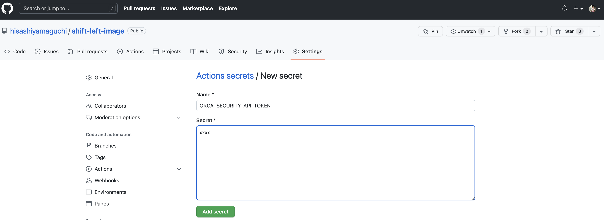

Test.

# Orca Security - Shift Left Security quick start guide
Orca Security has a capability of DevSecOps - a concept & philosopy of the
collaborative security improvement framework for the entire SDLS. The repo here
is a quick demo for your audiences.
<br>
<br>


## Prerequisites
- Orca Security free trial license - visit [Orca Security](https://orca.security/lp/cloud-security-risk-assessment/) if you don't have
  a free trial license.
- GitHub account.
- MacBook with GitHub CLI.
<br>
<br>


## Set-up
Go Orca dashboard, and click "Shift Left" on the left pane and click "CREATE NEW". Put a name on Project name field and put an unique name on Project key field - this must be unique and the value must be specified on your GitHub Action workflow yml. Select "Orca Built-in Container Image Best Practices Policy", and click "Create".
<br>
<div align="center">

</div>
<br>

Click the settings icon on the top right, and click "Authorization" on the left
pane. Click "CREATE API TOKEN", and put a name on Name field. Click "CREATE
TOKEN" and you may find an API Token on the screen - grab it.
<br>
<div align="center">

</div>
<br>

Folk the repo, and go "Settings" -> "Secrets" -> "Actions". Click "New
repository secret", and put "ORCA_SECURITY_API_TOKEN" on Name field and put the
API Token value on Secret field, and click Add secret.
<div align="center">

</div>
<br>

[Go GitHub Actions workflow yml](https://github.com/hisashiyamaguchi/shift-left-image/blob/main/.github/workflows/ci-with-imagescan-pipeline.yml), and put your Project key that you just
specified on Orca dashboard.
```yml
env: 
  IMAGE_NAME: base_infra:latest
  PROJECT_KEY: hogehoge
  CLI_VERSION: latest
```

<br>
<br>


## Demo!
1. Explain the concept of DevSecOps to your audiences with short words, and expain the demo platform & prerequisite.
2. Show [test/samples/poetry.lock](https://github.com/hisashiyamaguchi/shiftleft-fs-action/blob/main/test/samples/poetry.lock). The file has tons of external libraries dependencies - Orca is going to scan this definition, and if Orca detects any policy violations, the delivery pipeline is going to be stopped.
3. Go back to Orca console, and show your policy. "Orca Built-in - Source Code Vulnerabilities Policy"(the bottom one) is the policy that going to be applied to this demo repo.
4. Clone the repo to your local laptop. Go the repo directory and any codes - README.md is the easiest.
5. Commit the change locally and push the commit to remote repo - GitHub Actions workflow will be triggered, and start buiding&scanning the poetry.lock.
6. Orca Security is going to detect the policy violation, and the scanning will be fail - the reason is your external libraries has some vulnerabilities.
7. Visit Orca dashboard and show scanning logs - you can show red flag error logs - that's it!
<div align="center">

<br>

</div>
<br>
<br>

## Issue Reporting
If you have found a bug or if you have updates request, please report them at this repository issues section.
